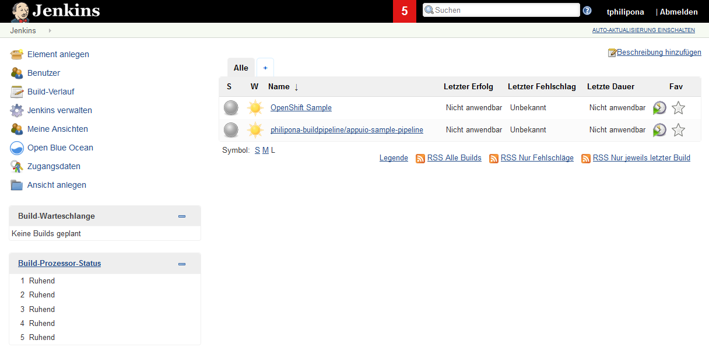
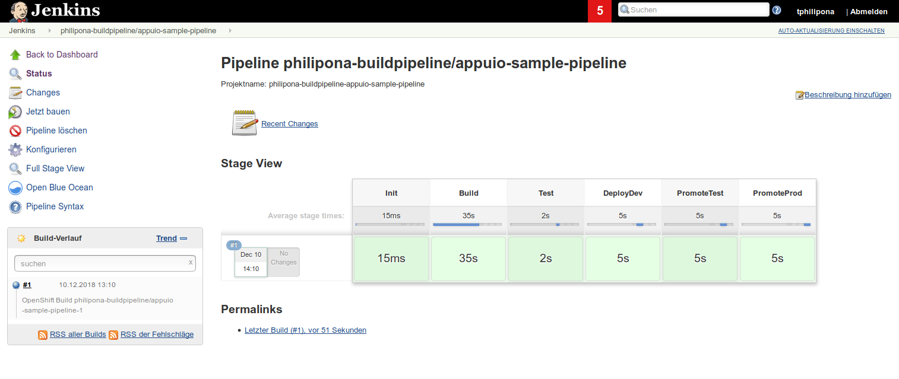

# OpenShift Pipelines

Mit OpenShift Pipelines hat man die Möglichkeit komplexe CI/CD Prozesse voll integriert abzubilden. In diesem Lab zeigen wir, wie man mit OpenShift Pipelines arbeitet und so Applikationen buildet, tested und entsprechend kontrolliert in die verschiedenen Stages promoted.

https://docs.openshift.com/container-platform/3.9/dev_guide/dev_tutorials/openshift_pipeline.html

## Grundprinzip

OpenShift Pipelines basieren auf Jenkins Pipelines, welche voll integriert mit OpenShift fungieren. So hat man BuildConfigs vom Typ `jenkinsPipelineStrategy` anzulegen, welche wieder eine Jenkins Pipeline referenzieren.


## LAB: Eine einfache OpenShift Pipeline anlegen und ausführen.

Um zu verstehen wie OpenShift Pipelines funktionieren wollen wir als ersten Schritt direkt eine Pipeline anlegen.

Erstellen wir dafür ein neues Projekt `oc new-project [USER]-buildpipeline`

Wir legen mit folgendem Befehl die entsprechende BuildConfig an, welche als Input auf das JenkinsFile in einem Gitrepository https://github.com/appuio/simple-openshift-pipeline-example.git verweist.

```bash
$ oc create -f ./additional-labs/resources/simple-openshift-pipeline.yaml
```

Auf Grund der BuildConfig deployt OpenShift automatisch eine integrierte Jenkins Instanz. Schauen wir uns dies in der Web Console an. Im Projekt befindet sich nach erfolgreichem Deployment eine laufende Jenkins Instanz, welche über eine Route exposed ist. Der Zugriff auf den Jenkins über die Route ist mittles OpenShift Oauth gesichert, loggen Sie dort ein und erteilen Sie entsprechende Rechte. Ebenso wurde die vorher angelegte Build Pipeline synchronisiert und automatisch angelegt.



Nebst der erstellten Build Pipeline wurde auch die OpenShift Sample Pipeline angelegt.

Zurück in der OpenShift Web Console können wir nun über Builds --> Pipelines die Pipeline starten.


Dabei wird von OpenShift der Jenkins Job gestartet und entsprechend in die Pipeline Ansicht synchronisiert.





Unser Beispiel hier enthält Testpipeline, die das generelle Prinzip veranschaulicht, jedoch bieten Jenkins Pipelines volle Flexiblität um komplexe CI/CD Pipelines abzubilden.

```
node {
    stage('Build') {
        echo "Build"
	sleep 5
    }
    stage('Test') {
        echo "Test"
	sleep 2
    }
}
node ('maven') {    
    stage('DeployDev') {
        echo "Deploy to Dev"
	sleep 5
    }
    stage('PromoteTest') {
        echo "Deploy to Test"
	sleep 5
    }
    stage('PromoteProd') {
        echo "Deploy to Prod"
	sleep 5
    }
}
```

Die Testpipeline besteht aus fünf Steps, welche auf zwei Jenkins Slaves ausgeführt werden. Die letzten drei Steps werden bedingt durch den node selector `node ('maven') { ... }` auf einem Jenkins Slave mit dem Namen `maven` ausgeführt. Dabei startet OpenShift mittels Kubernetes Plugin dynamisch einen Jenkins Slave Pod und führt entsprechend diese Stages auf diesem Slave aus. 

Der `maven` Slave ist im Kubernetes Plugin vorkonfiguriert und die Stages auf dem Slave `registry.access.redhat.com/openshift3/jenkins-slave-maven-rhel7:v3.7` ausgeführt. Weiter unten im Kapitel zu Custom Slaves werden Sie lernen, wie man individuelle Slaves dazu verwendet um Pipelines darauf auszuführen.

## BuildConfig Optionen

Im vorherigen Lab haben wir der BuildConfig vom Typ `jenkinsPipelineStrategy` ein Git Repository als Source für das JenkinsFile angegeben. Als Alternative dazu kann das Jenkins Pipeline File auch direkt in der BuildConfig hinterlegt werden.

```yaml
kind: "BuildConfig"
apiVersion: "v1"
metadata:
  name: "appuio-sample-pipeline"
spec:
  strategy:
    jenkinsPipelineStrategy:
      jenkinsfile: |-
        node {
            stage('Build') {
                echo "Build"
            sleep 5
            }
            stage('Test') {
                echo "Test"
            sleep 2
            }
        }
        node ('maven') {    
            stage('DeployDev') {
                echo "Deploy to Dev"
            sleep 5
            }
            stage('PromoteTest') {
                echo "Deploy to Test"
            sleep 5
            }
            stage('PromoteProd') {
                echo "Deploy to Prod"
            sleep 5
            }
        }

```

## Jenkins OpenShift Plugins

Der durch OpenShift dynamisch deployte Jenkins, ist durch das OpenShift Plugin vollständig mit OpenShift gekoppelt. Einerseits kann so direkt auf Resourcen innerhalb des Projekts zugegriffen werden, andererseits können durch entsprechendes Labeling dynamische Slaves aufgesetzt werden.

Zusäztliche Informationen finden Sie hier: https://docs.openshift.com/container-platform/3.9/install_config/configuring_pipeline_execution.html#openshift-jenkins-client-plugin

### OpenShift Jenkins Pipeline

Mit dem OpenShift Jenkins Client Plugin kann so auf einfach Art direkt mit dem OpenShift Cluster kommuniziert werden und entsprechend als Jenkinsfile komplexe Ci/CD Pipelines implementieren:

```
openshift.withCluster() {
    openshift.withProject() {
        echo "Hello from project ${openshift.project()} in cluster ${openshift.cluster()}"
    }
}
```
weitere Informationen dazu sind unter https://github.com/openshift/jenkins-client-plugin/blob/master/README.md zu finden.

Zusätlich zum Client Plugin existiert das vorgänger Plugin (Jenkins Pipeline Plugin), welches weniger Funktionalität bietet, allerdings gemäss https://docs.openshift.com/container-platform/3.9/using_images/other_images/jenkins.html#pipeline-plug-in supportet bleibt.

### OpenShift Jenkins Sync Plugin

Das OpenShift Jenkins Sync Plugin hält BuildConfig und Jenkins Jobs synchron. Des Weiteren erlaubt es das dynamische erstellen und definieren von Jenkins Slaves via Imagestream.

### Kubernetes Plugin

Das Kubernetes Plugin wird verwendet um die Jenkins Slaves dynamisch im OpenShift Projekt zu starten. 

### Custom Slaves

Custom Jenkins Slaves können einfach in den Build integriert werden, dafür müssen die entsprechenden Slaves als Imagestreams angelegt und mit dem label `role=jenkins-slave` versehen werden. Diese werden dann automatisch als Pod Templates im Jenkins für das Kubernetes Plugin registriert. So können Pipelines nun über `node ('customslave'){ ... }` Teile ihrer Builds auf den entsprechenden Custom Slaves laufen lassen.

#### LAB: Custom Jenkins Slave als Build Slave verwenden

TODO

## Best Practice Multi Stage Deployment

Für ein Multi Stage Deployment auf OpenShift hat sich das folgende Setup als Bestpractice erwiesen.

* Ein Build Projekt, CI/CD Umgebung Jenkins, Docker Builds, S2I Builds ...
* Pro Stage (dev, test, ..., prod) ein Projekt, welche die laufenden Pods und Services enthält.

Das Build Projekt haben wir oben bereits eingerichtet `[USER]-buildpipeline` als nächsten Schritt erstellen wir nun die Projekte für die unterschiedlichen Stages

* `oc new-project [USER]-pipeline-dev`
* `oc new-project [USER]-pipeline-test`
* `oc new-project [USER]-pipeline-prod`

Nun müssen wir den `puller` Service Accounts aus den entsprechenden Projekten für die Stage die nötigen Rechte geben, damit die gebuildeten Images gepullt werden können.

```
oc policy add-role-to-group system:image-puller system:serviceaccounts:[USER]-pipeline-dev -n [USER]-buildpipeline
oc policy add-role-to-group system:image-puller system:serviceaccounts:[USER]-pipeline-test -n [USER]-buildpipeline
oc policy add-role-to-group system:image-puller system:serviceaccounts:[USER]-pipeline-prod -n [USER]-buildpipeline
```

Als nächstes erstellen wir in den entsprechenden Stage Projekten die Applikationen, dafür definieren wir einen Tag im Imagestream, welcher deployt werden soll.

* dev `oc new-app [USER]-buildpipeline/application:dev -n [USER]-pipeline-dev`
* test `oc new-app [USER]-buildpipeline/application:test -n [USER]-pipeline-test` 
* prod `oc new-app [USER]-buildpipeline/application:prod -n [USER]-pipeline-prod` 

In der Pipeline können wir nun mittels setzen des entsprechenden Tags bspw. `application:dev` das entsprechende Image in die passende Stage promoten.

TODO: entsprechende Pipeline implementieren.
```
...
node ('maven') {    
    stage('DeployDev') {
        script {
            openshift.withCluster() {
                openshift.withProject() {
                    # Tag the latest image to be used in dev stage
                    openshift.tag("[USER]-buildpipeline/application:latest", "[USER]-buildpipeline/application:dev")
                    # trigger deployment
                    def rm = openshift.selector("dc", "application").rollout()
                    openshift.selector("dc", "application").related('pods').untilEach(1) {
                        return (it.object().status.phase == "Running")
                    }
                }
            }
        }
	sleep 5
    }
    stage('PromoteTest') {
        script {
            openshift.withCluster() {
                openshift.withProject() {
                    # Tag the latest image to be used in dev stage
                    openshift.tag("[USER]-buildpipeline/application:dev", "[USER]-buildpipeline/application:test")
                    # trigger deployment
                    def rm = openshift.selector("dc", "application").rollout()
                    openshift.selector("dc", "application").related('pods').untilEach(1) {
                        return (it.object().status.phase == "Running")
                    }
                }
            }
        }
	sleep 5
    }
    ...
}
```