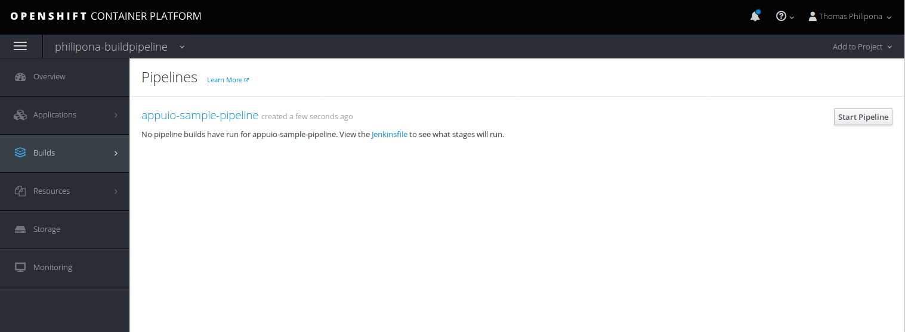
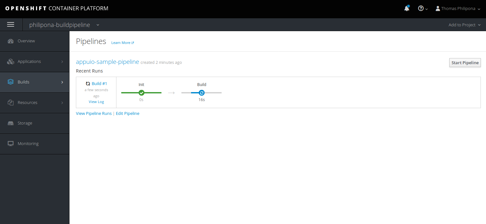
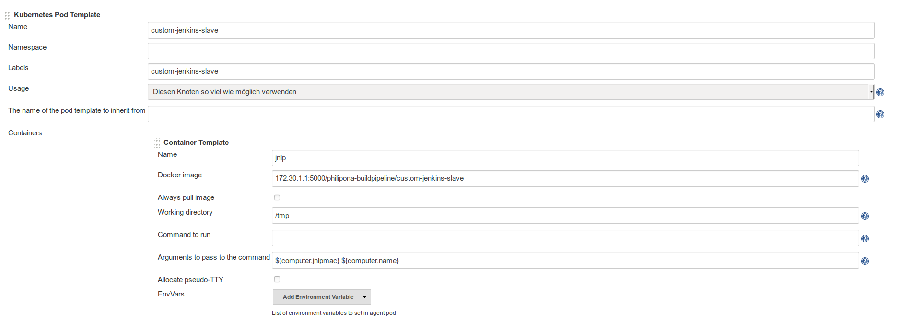

# OpenShift Pipelines

Mit OpenShift Pipelines hat man die Möglichkeit komplexe CI/CD Prozesse voll integriert abzubilden. In diesem Lab zeigen wir, wie man mit OpenShift Pipelines arbeitet und so Applikationen buildet, testet und entsprechend kontrolliert in die verschiedenen Stages deployt.

https://docs.openshift.com/container-platform/3.9/dev_guide/dev_tutorials/openshift_pipeline.html

## Grundprinzip

OpenShift Pipelines basieren auf Jenkins Pipelines, welche voll integriert mit OpenShift fungieren. So hat man BuildConfigs vom Typ `jenkinsPipelineStrategy` anzulegen, welche wieder eine Jenkins Pipeline referenzieren.

## LAB: Eine einfache OpenShift Pipeline anlegen und ausführen.

Um zu verstehen wie OpenShift Pipelines funktionieren, wollen wir als ersten Schritt direkt eine Pipeline anlegen.

Erstellen wir dafür ein neues Projekt `oc new-project [USER]-buildpipeline`

Wir legen mit folgendem Befehl die entsprechende BuildConfig an, welche das JenkinsFile also die Pipeline direkt beinhaltet. Ebenso wird eine zweite BuildConfig erstellt. Diese enthält die Docker BuildConfig für die eigentliche Applikation, die wir im Rahmen dieser Pipeline deployen wollen. Im vorliegenden Beispiel eine simple PHP Applikation.

```bash
$ oc create -f ./additional-labs/resources/simple-openshift-pipeline.yaml
```

Auf Grund der BuildConfig deployt OpenShift automatisch eine integrierte Jenkins Instanz. Schauen wir uns dies in der Web Console an. Im Projekt befindet sich nach erfolgreichem Deployment eine laufende Jenkins Instanz, welche über eine Route exposed ist. Der Zugriff auf den Jenkins über die Route ist mittels OpenShift OAuth gesichert. Loggen Sie dort ein und erteilen Sie der OAuth entsprechende Rechte. Ebenso wurde die vorher angelegte Build Pipeline synchronisiert und automatisch angelegt.


Nebst der erstellten Build Pipeline wurde auch die OpenShift Sample Pipeline angelegt.

Zurück in der OpenShift Web Console können wir nun über Builds --> Pipelines die Pipeline starten.



Dabei wird von OpenShift der Jenkins Job gestartet und entsprechend in die Pipeline Ansicht synchronisiert.




Unser Beispiel hier enthält eine Testpipeline, die das generelle Prinzip veranschaulicht. Jedoch bieten Jenkins Pipelines volle Flexiblität um komplexe CI/CD Pipelines abzubilden.

```groovy
def project=""
node {
    stage('Init') {
        project = env.PROJECT_NAME
    }
    stage('Build') {
        echo "Build"
        openshift.withCluster() {
            openshift.withProject() {
                def builds = openshift.startBuild("application"); 
                builds.logs('-f')
                timeout(5) {
                    builds.untilEach(1) {
                    return (it.object().status.phase == "Complete")
                    }
                }
            }
        }
    }
    stage('Test') {
        echo "Test"
        sleep 2
    }
}
node ('maven') {    
    stage('DeployDev') {
        echo "Deploy to Dev"
        sleep 5
    }
    stage('PromoteTest') {
        echo "Deploy to Test"
        sleep 5
    }
    stage('PromoteProd') {
        echo "Deploy to Prod"
        sleep 5
    }
}
```

Die Testpipeline besteht aus sechs Pipeline-Stages, welche auf zwei Jenkins Slaves ausgeführt werden. Die `Build` Pipeline-Stage, ist aktuell die einzig ausprogrammierte Stage. Sie startet nämlich im aktuellen OpenShift Projekt den Docker Build für unsere Applikation und wartet entsprechend bis dies erfolgreich abgeschlossen ist.

Die letzten drei Steps werden bedingt durch den node selector `node ('maven') { ... }` auf einem Jenkins Slave mit dem Namen `maven` ausgeführt. Dabei startet OpenShift mittels Kubernetes Plugin dynamisch einen Jenkins Slave Pod und führt entsprechend diese Build-Stages auf diesem Slave aus. 

Der `maven` Slave ist im Kubernetes Plugin vorkonfiguriert und die Pipeline-Stages werden auf dem Slave `registry.access.redhat.com/openshift3/jenkins-slave-maven-rhel7:v3.7` ausgeführt. Weiter unten im Kapitel zu Custom Slaves werden Sie lernen, wie man individuelle Slaves dazu verwendet um Pipelines darauf auszuführen.

## BuildConfig Optionen

Im vorherigen Lab haben wir in der BuildConfig vom Typ `jenkinsPipelineStrategy` das JenkinsFile direkt angegeben. Als Alternative dazu kann das Jenkins Pipeline File auch via GitRepository in der BuildConfig hinterlegt werden.

```yaml
kind: "BuildConfig"
apiVersion: "v1"
metadata:
  name: "appuio-sample-pipeline"
spec:
  source:
    git:
      uri: "https://github.com/appuio/simple-openshift-pipeline-example.git"
  strategy:
    jenkinsPipelineStrategy:
      jenkinsfilePath: Jenkinsfile

```

## Jenkins OpenShift Plugins

Der durch OpenShift dynamisch deployte Jenkins, ist durch eine reihe von OpenShift Jenkins Plugins vollständig mit OpenShift gekoppelt. Einerseits kann so direkt auf Ressourcen innerhalb des Projekts zugegriffen werden, andererseits können durch entsprechendes Labeling dynamische Slaves aufgesetzt werden. Des Weiteren wird auch ein entsprechender Serviceaccount (`jenkins`) erstellt. Die Rechtevergabe kann entsprechend über diesen Serviceacount erfolgen.

Zusätzliche Informationen finden Sie hier: https://docs.openshift.com/container-platform/3.9/install_config/configuring_pipeline_execution.html#openshift-jenkins-client-plugin

### OpenShift Jenkins Pipeline

Mit dem OpenShift Jenkins Client Plugin kann so auf einfach Art direkt mit dem OpenShift Cluster kommuniziert werden und entsprechend als Jenkinsfile komplexe Ci/CD Pipelines implementieren:

```
openshift.withCluster() {
    openshift.withProject() {
        echo "Hello from project ${openshift.project()} in cluster ${openshift.cluster()}"
    }
}
```

Das Plugin funktioniert als Wrapper zum `oc client`. Mit dem Plugin stehen einem also sämtliche Funktionalität des clients zur Verfügung.

weitere Informationen dazu sind unter https://github.com/openshift/jenkins-client-plugin/blob/master/README.md zu finden.

Zusätzlich zum Client Plugin existiert das vorgänger Plugin (Jenkins Pipeline Plugin), welches weniger Funktionalität bietet, allerdings gemäss https://docs.openshift.com/container-platform/3.9/using_images/other_images/jenkins.html#pipeline-plug-in supportet bleibt.

### OpenShift Jenkins Sync Plugin

Das OpenShift Jenkins Sync Plugin hält BuildConfig und Jenkins Jobs synchron. Des Weiteren erlaubt es das dynamische erstellen und definieren von Jenkins Slaves via ImageStream, mehr dazu weiter unten.

### Kubernetes Plugin

Das Kubernetes Plugin wird verwendet um die Jenkins Slaves dynamisch im OpenShift Projekt zu starten. 

### Custom Slaves

Custom Jenkins Slaves können einfach in den Build integriert werden, dafür müssen die entsprechenden Slaves als ImageStreams angelegt und mit dem label `role=jenkins-slave` versehen werden. Diese werden dann automatisch als Pod Templates im Jenkins für das Kubernetes Plugin registriert. So können Pipelines nun über `node ('customslave'){ ... }` Teile ihrer Builds auf den entsprechenden Custom Slaves laufen lassen.

#### LAB: Custom Jenkins Slave als Build Slave verwenden

Um Custom Images als Jenkins Slaves zu verwenden muss man entsprechend auf dem ImageStream ein Label definieren `role=jenkins-slave`

Auf Grund des Labels synchronisiert das Jenkins Sync Plugin dann entsprechend die Konfiguration für das Kubernetes Plugin als Pod Templates. Beim Starten des Jenkins werden so gelabelte ImagesStreams gesynched und im Jenkins als Kubernetes Pod Templates angelegt. 

Erstellen wir nun in unserem Projekt einen Custom Jenkins Slave. Zur Veranschaulichung verwenden wir dazu ein Image von Docker Hub, das als Maven Jenkins Slave fungiert.

```bash
$ oc import-image custom-jenkins-slave --from=docker.io/openshift/jenkins-slave-maven-centos7 --confirm
```

Anschliessend definieren wir mittels dem label `role` noch, dass es sich um einen Jenkins Slave handelt.

```bash
$ oc label is custom-jenkins-slave role=jenkins-slave
```

Um den Custom Slave im Jenkins auch verfügbar zu haben, müssen wir nun den Jenkins Master restarten.

```bash
$ oc rollout latest jenkins
```

Schauen wir uns die Konfiguration num nach dem Restart im Jenkins Konfigurations Menu an: https://[jenkins-route]/configure 
Unser `custom-jenkins-slave` ist unter den Kubernetes Pod Templates ersichtlich,



und kann mittels folgender Ergänzung im JenkinsFile entsprechend in der Pipeline verwendet werden.

```groovy
node ('custom-jenkins-slave') {
    stage('custom stage') {
        echo "Running on the custom jenkins slave"
    }
}
```

Über diesen Mechanismus lassen sich beliebige - auch selbst gebuildete Jenkins Slaves - aufsetzen und verwenden. Es stehen out of the Box ein `maven und gradle` und ein `NodeJs` Slave zur Verfügung.

Will man selber Jenkins Slaves builden, sollte man auf dem `openshift/jenkins-slave-base-centos7` Image basieren.

## LAB: Multi Stage Deployment

Als nächstes wollen wir nun unsere Pipeline weiter ausbauen und das Deployment der Applikation auf den unterschiedlichen Stages (dev, test, prod) angehen.

Für ein Multi Stage Deployment auf OpenShift hat sich das folgende Setup als Bestpractice erwiesen.

* Ein Build Projekt, CI/CD Umgebung Jenkins, Docker Builds, S2I Builds ...
* Pro Stage (dev, test, ..., prod) ein Projekt, welche die laufenden Pods und Services enthält. Dies erlaubt es uns sämtliche Umgebungen möglichst identisch zu halten.

Das Build Projekt haben wir oben bereits eingerichtet `[USER]-buildpipeline` als nächsten Schritt erstellen wir nun die Projekte für die unterschiedlichen Stages

* `oc new-project [USER]-pipeline-dev`
* `oc new-project [USER]-pipeline-test`
* `oc new-project [USER]-pipeline-prod`

Nun müssen wir den `puller` Serviceaccount aus den entsprechenden Projekten pro Stage die nötigen Rechte geben, damit die gebuildeten Images gepullt werden können.

```bash
oc policy add-role-to-group system:image-puller system:serviceaccounts:[USER]-pipeline-dev -n [USER]-buildpipeline
oc policy add-role-to-group system:image-puller system:serviceaccounts:[USER]-pipeline-test -n [USER]-buildpipeline
oc policy add-role-to-group system:image-puller system:serviceaccounts:[USER]-pipeline-prod -n [USER]-buildpipeline
```

Des Weiteren müssen wir nun dem `jenkins` Serviceaccount aus dem `[USER]-buildpipeline` entsprechend Rechte geben, dass er in den Projekten der Stages Ressourcen anlegen kann.

```bash
oc policy add-role-to-user edit system:serviceaccount:[USER]-buildpipeline:jenkins -n [USER]-pipeline-dev
oc policy add-role-to-user edit system:serviceaccount:[USER]-buildpipeline:jenkins -n [USER]-pipeline-test
oc policy add-role-to-user edit system:serviceaccount:[USER]-buildpipeline:jenkins -n [USER]-pipeline-prod
```

Als nächstes erstellen wir in den entsprechenden Stage Projekten die Applikationen, dafür definieren wir einen Tag im ImageStream, welcher deployt werden soll. Dafür müssen wir aber zuerst die entsprechenden Tags erstellen, die deployt werden sollen.

```bash
oc tag [USER]-buildpipeline/application:latest [USER]-buildpipeline/application:dev
oc tag [USER]-buildpipeline/application:dev [USER]-buildpipeline/application:test
oc tag [USER]-buildpipeline/application:test [USER]-buildpipeline/application:prod
```

**Erstellen der Applikationen**

* dev `oc new-app [USER]-buildpipeline/application:dev -n [USER]-pipeline-dev`
* test `oc new-app [USER]-buildpipeline/application:test -n [USER]-pipeline-test`
* prod `oc new-app [USER]-buildpipeline/application:prod -n [USER]-pipeline-prod`

In der Pipeline können wir nun mittels Setzen des entsprechenden Tags auf dem Imagestream der gebuildeten Applikatoin bspw. `application:dev` das entsprechende Image in die passende Stage promoten und mittels Deployment die entsprechende Version deployen.

Passen sie ihre Pipeline entweder in der Web Console oder in der BuildConfig wie folgt an (die Werte für die Variablen `dev_project`, `test_project`, `prod_project` entsprechend setzen):

```groovy
def project=""
def dev_project="[USER]-pipeline-dev"
def test_project="[USER]-pipeline-test"
def prod_project="[USER]-pipeline-prod"
node {
    stage('Init') {
        project = env.PROJECT_NAME
    }
    stage('Build') {
        echo "Build"
        openshift.withCluster() {
            openshift.withProject() {
                def builds = openshift.startBuild("application")
                builds.logs('-f')
                timeout(5) {
                    builds.untilEach(1) {
                    return (it.object().status.phase == "Complete")
                    }
                }
            }
        }
    }
    stage('Test') {
        echo "Test"
        sleep 2
    }
}
node ('maven') {
    stage('DeployDev') {
        echo "Deploy to Dev"
        openshift.withCluster() {
            openshift.withProject() {
                // Tag the latest image to be used in dev stage
                openshift.tag("$project/application:latest", "$project/application:dev")
            }
            openshift.withProject(dev_project) {
                // trigger Deployment in dev project
                def dc = openshift.selector('dc', "application")
                dc.rollout().status()
            }
        }
    }
    stage('PromoteTest') {
        echo "Deploy to Test"
        openshift.withCluster() {
            openshift.withProject() {
                // Tag the dev image to be used in test stage
                openshift.tag("$project/application:dev", "$project/application:test")
            }
            openshift.withProject(test_project) {
                // trigger Deployment in test project
                def dc = openshift.selector('dc', "application")
                dc.rollout().status()
            }
        }
    }
    stage('PromoteProd') {
        echo "Deploy to Prod"
        openshift.withCluster() {
            openshift.withProject() {
                // Tag the test image to be used in prod stage
                openshift.tag("$project/application:test", "$project/application:prod")
            }
            openshift.withProject(prod_project) {
                // trigger Deployment in prod project
                def dc = openshift.selector('dc', "application")
                dc.rollout().status()
            }
        }
    }
}
```

Führen Sie die Pipeline erneut aus und schauen Sie sich an, wie nun die gebuildete Applikation von Stage zu Stage deployt wird.

## Jenkins Pipeline Sprache

Unter https://github.com/puzzle/jenkins-techlab finden Sie ein entsprechendes Hands-on Lab zur Jenkins Pipeline Sprache. Die Syntax ist [hier](https://jenkins.io/doc/book/pipeline/syntax/) beschrieben.

## Deployment von Resourcen und Konfiguration

Bisher haben wir nur die Applikation mittels unserer Deployment Pipeline deployt, wie können wir nun unsere Pipeline auch dazu verwenden um Resourcen (DeploymentConfigs, Routen, Cronjobs...) zu deployen?

Ebenso haben wir weiter oben mit dem Befehl `oc new-app [USER]-buildpipeline/application:stage -n [USER]-pipeline-stage` entsprechend im Hintergrund die nötigen Ressourcen angelegt. In unserem Fall `Service` und `DeploymentConfig`.

Diese Resourcen sind Konfiguration die sich analog der eigentlichen Applikation weiterentwickeln kann und ebenso mittles CI/CD Pipeline deployt werden sollten.

Ein gutes Beispiel zur Verantschaulichung der Notwendigkeit sind die Konfigurationswerte der Umgebungsvariablen zur Konfiguration der eigentlichen Applikation. So als Beispiel die Verbindung zu einem Mail Server der aus der Applikation dafür verwendet wird Mails zu versenden. 

Ändern Parameter in dieser Konfiguration auf einer Umgebung, bspw. Username oder Passwort sollen diese Werte mittels Pipeline deployt werden.

Als Grundprinzip kann man sich das so vorstellen:
* Resourcen werden als Files (`yaml` oder `json`) im Git verwaltet
* Im Rahmen der Deploymentpipeline werden diese Ressourcen entsprechend auf dem Kubernetes Cluster angewendet.

Es kann sogar so weit gehen, dass man Ressourcen, welche noch nicht existieren, via Pipeline erstellt. Somit die ganze Umgebung also per Knopfdruck aufgesetzt werden kann.

In der Jenkins Pipeline erfolgt dies dann über den `openshift.apply(r)` Befehl, wobei die Variable `r` der entsprechenden Ressource entspricht.